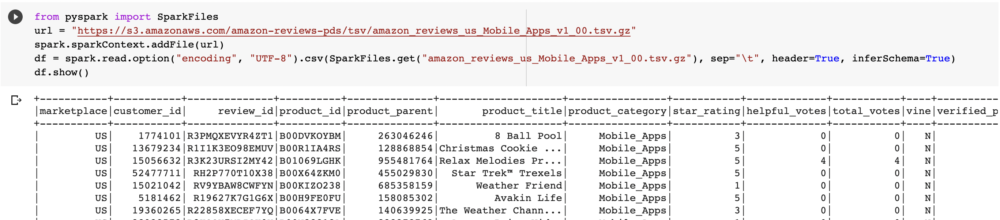
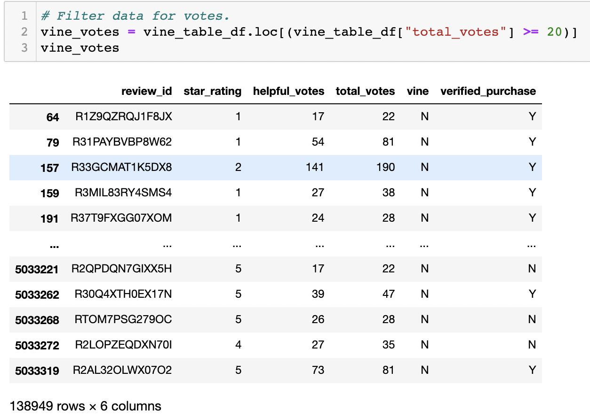
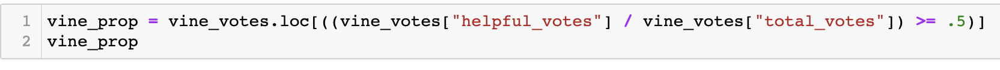
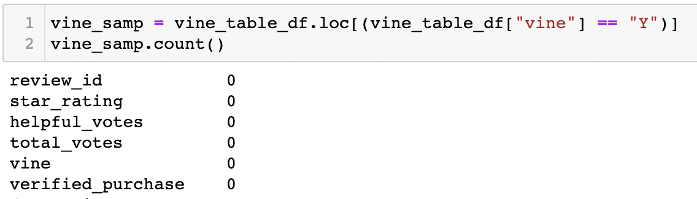

# Amazon_Vine_Analysis

## Overview 

The Amazon Vine program is a service that allows manufacturers and publishers to receive reviews for their products. For this module, I created the ETL process on reviews dataset and later performed an analysis to test for potential bias. For the first stage of the process, I extracted data from the an AWS dataset for mobile app reviews from the vine program. Below is the code used to perform the api that extracted the table from the amazon dataset. 

After the extraction, I used PySpark to transform my dataset into 4 unique tables. After the creation of my tables, I connected to my SQL server and loaded those tables into a PgAdmin dataset linked to my personal AWS DataBase. Once I loaded my tables into my database, I performed an analysis on one of my tables in order test for any potential bias based on the reviews from people participating in the vine program, as opposed to regular reviews. 

## Results

To limit sampling bias due to a small sample size, I filtered my dataset using the **.loc()** function to select products with at least 20 reviews. Below is an image of my code and the resulting table.

The table was then filtered again, to find only the reviews that customers thought were helpful or insightful to the product. This filtering method was done by creating a proportion of (helpful_votes over the total_votes). Please see the code snippet below.

- Total Reviews
  - Vine Votes: 0 
  - Non-Vine: 129,516

Immediately I can see that no reviews from those participating in the vine program met my initial selection criteria. This is something that I will address in the summary section of this report. 

- Five Star: Reviews
  - Vine: 0
  - Non-Vine: 59278

- 5 Star Review: Percentage
  - N/A
  - 45.76 %

## Summary

Based on the data in my table I am unable to come to any conclusion on potential bias from vine reviews. Unfortunetaly the data set that I selected for mobile app reviews did not contain any reviews from the vine program. To ensure that the data was not just filtered out from my table, I ran the loc function on my originally imported data and I received a 0 count as well. Below is an image of my search and the results.

If there was data from vine program participants, I would have compared the ratio of 5-star reviews from the vine partipants to the regular reviews. As it stands there were no reviews from vine participants in my dataset, so my analysis is inconclusive for reviews.
